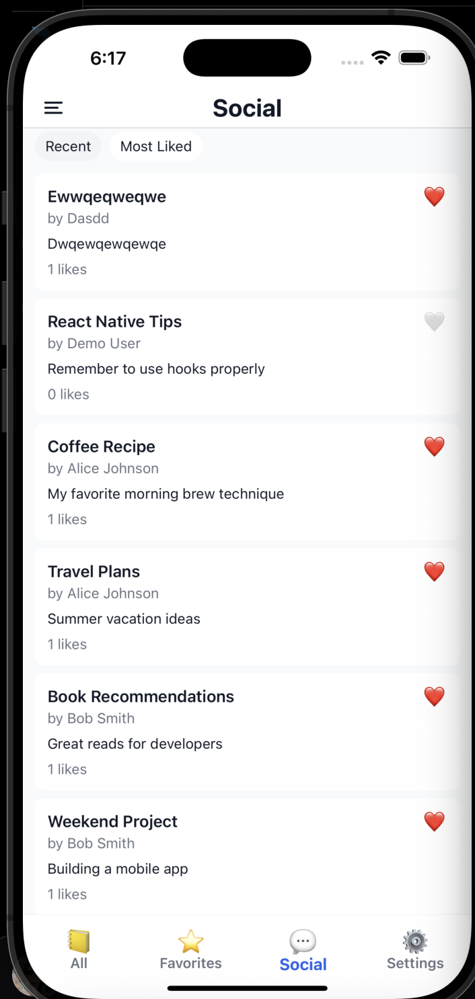
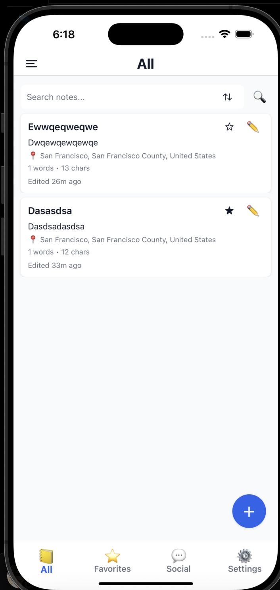
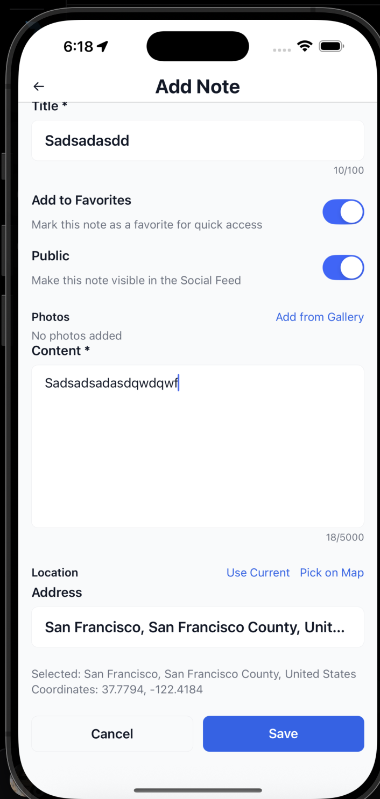
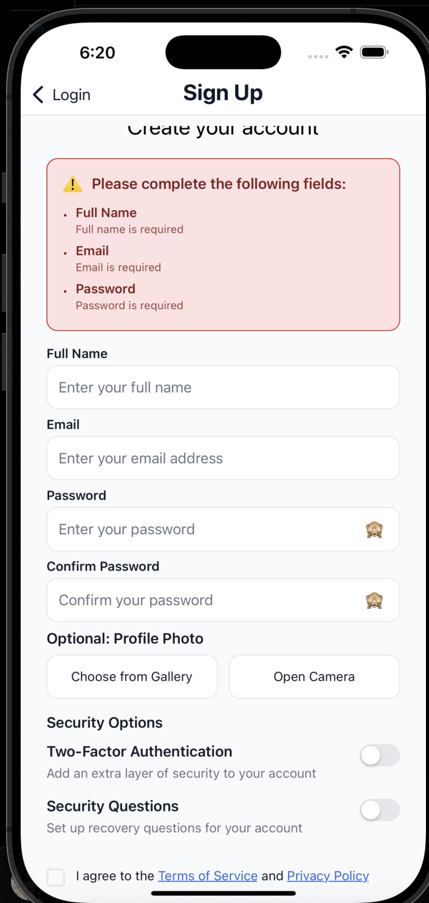
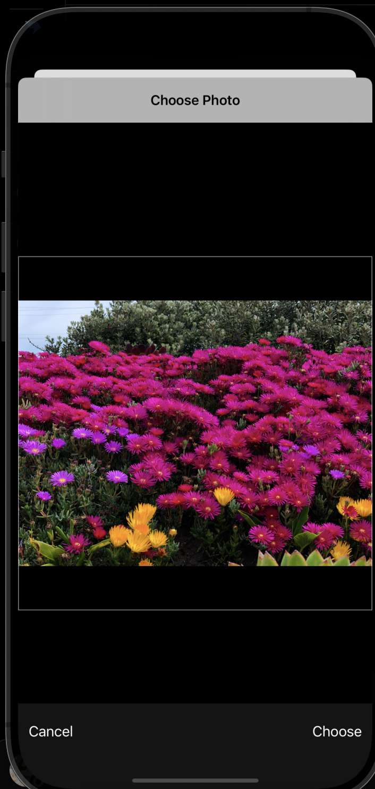

## Task 2 – Notes App (Expo + React Native)

Small notes app built with Expo, React Native, and TypeScript.

## Prerequisites

- **Node.js**: v18 or newer
- **npm**: v9+ (or use yarn/pnpm if you prefer)
- Optional (for device simulators):
  - **Xcode** (for iOS)
  - **Android Studio** (for Android)

## Setup

1. Install dependencies:

```bash
npm install
```

2. Start the Expo development server:

```bash
npm run start
```

3. Run on a target:

```bash
# iOS simulator (macOS only)
npm run ios

# Android emulator (or connected device)
npm run android

# Web
npm run web
```

If you use the Expo app on a physical device, scan the QR code from the terminal/Expo DevTools after `npm run start`.

## Scripts

- `npm run start`: Start the Expo dev server
- `npm run ios`: Open iOS simulator and run the app
- `npm run android`: Open Android emulator and run the app
- `npm run web`: Run the web version

## Screenshots

<table>
  <tr>
    <td></td>
    <td></td>
    <td></td>
  </tr>
  <tr>
    <td></td>
    <td></td>
    <td></td>
  </tr>
  <tr>
    <td></td>
    <td></td>
    <td></td>
  </tr>
  <tr>
    <td></td>
    <td></td>
    <td></td>
  </tr>
</table>
